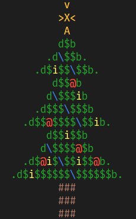

# Sub

> Substitutes strings

Ever thought that `sed` and `awk` were sedulously awkward to use? Ever wondered how ASCII art might look if we could give it some color?

Well, wonder no more!

Sub leverages Rust alongside the [`colored`](https://docs.rs/colored/latest/colored/index.html), [`argparse`](https://docs.rs/argparse/latest/argparse/), [`hex`](https://docs.rs/hex/latest/hex/) and [`regex`](https://docs.rs/regex/latest/regex/) libraries to let you replace and color characters directly from stdin.

## Usage

```
Usage:
  sub [OPTIONS] REPLACEMENT STRING SUBSTITUTION STRING

Replace characters, regular expressions or colors read from stdin.

Positional arguments:
  replacement string    The string to use for replacing.
  substitution string   The string to substitute with.

Optional arguments:
  -h,--help             Show this help message and exit
  -r,--regex            Interpret argument as regular expression.
  -c,--capture          Inject captured strings into substitute using &n where
                        n is a group number.
  -f,--fg FG            Set a new foreground color.
  -b,--bg BG            Set a new background color.
```

## Example - Merry Christmas

Ah, just in time for Christmas, I've found a christmas tree online.

```
         v
        >X<
         A
        d$b
      .d\$$b.
    .d$i$$\$$b.
       d$$@b
      d\$$$ib
    .d$$$\$$$b
  .d$$@$$$$\$$ib.
      d$$i$$b
     d\$$$$@$b
  .d$@i$\$$i$$@b.
.d$i$$$$$$\$$$$$$b.
        ###
        ###
        ###
```

But, it looks rather dull, does it not?

Well, with a little help from `sub`, we can give it some colors!

```sh
cat .\xmas_tree.txt | sub -f '#F4F556' i i | sub -f "#009302" -rc '([\.bd$])' '&1' | sub -f '#FFC300' -rc '([v<>XA])' '&1' | sub -f "#733719" '#' '#' | sub -f "FF5533" '@' '@' | sub -f "#0F73D9" '\' '\'
```

Let's break it down a bit:

- `cat` outputs our tree to stdout.
- Each call to `sub` reads every line from stdin and writes the modified lines to stdout.
- `sub -f '#F4F556' i i` sets [a foreground color](https://www.color-hex.com/color/f4f556) to each of the `i`-characters (the candles) in our tree. It replaces each i with another i, but applies the foreground color too.
- `sub -f "#009302" -rc '([\.bd$])' '&1'` matches all the characters in the pattern `[\.bd$]`, determined by the `-r` flag. It also captures all the characters in the pattern, determined by the `-c` flag and the parentheses outside the pattern. Then, it replaces the matched characters with ... themselves, since `'&1'` refers to the first group captured.

The rest of the calls use the same flags with different characters and colors.



## Requirements

A true-color terminal. Microsoft added the Windows Terminal, which you can get on the Windows store.
If you are running Linux, most terminals should support true-color.

## Installation

You can download a build for Windows or Linux from the releases page.
